# Setup Guide

This file documents the initial setup of the VoIP help desk lab, including user creation, client setup, internal calling, and basic ring group configuration.

## Setup Goal

The goal of this setup was to build a small VoIP support environment that could later be used for help desk-style ticket scenarios and basic call-routing tests.

## Lab Setup Summary

During setup, I completed the following tasks:

- accessed the 3CX Admin Console
- created test users and extensions
- reviewed the user list
- set up the Windows app
- tested softphone calling on iOS and Android
- created a ring group
- added users to the ring group

## Test Users

The following test users were used in this lab:

- 101 - Reception
- 102 - Help Desk Agent
- 103 - Sales Agent
- 104 - Manager

## Setup Steps

### 1. Accessed the Admin Console

The setup began in the 3CX Admin Console, where the system configuration and user management settings were available.

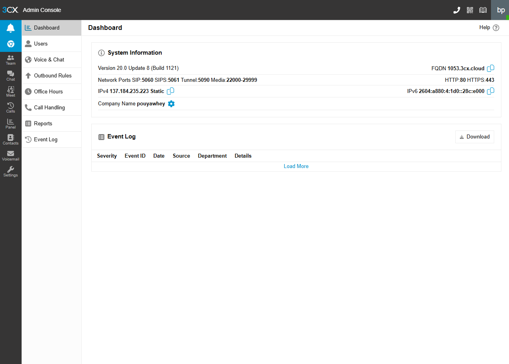

### 2. Created a User

A new user was added to the system to begin building the test environment. This included basic user details such as name, extension, and email information.

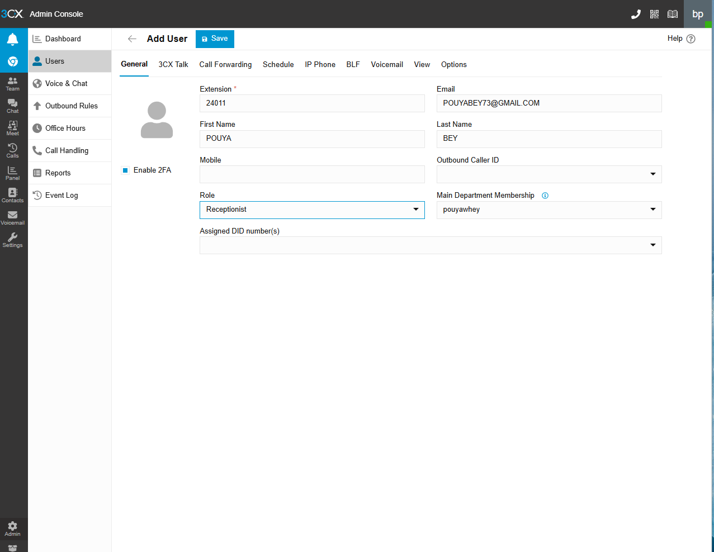

### 3. Reviewed the Users List

After creating users, the user list was reviewed to confirm that the extensions were added correctly and were available for testing.

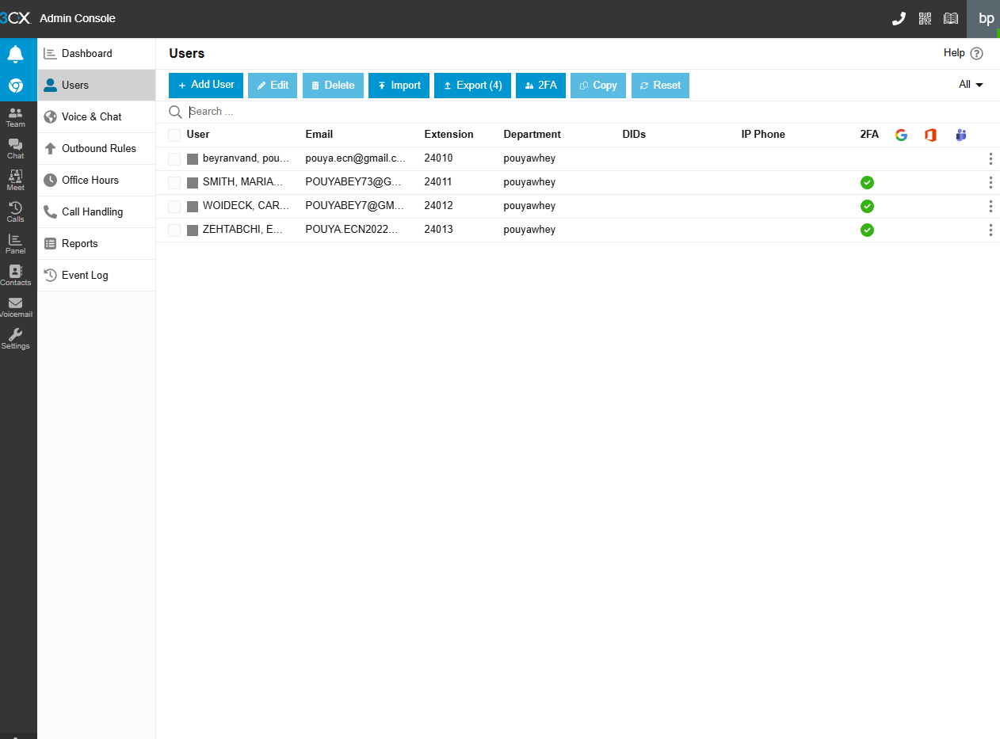

### 4. Set Up the Windows App

The Windows softphone was added so a desktop client could be used for login and calling tests.

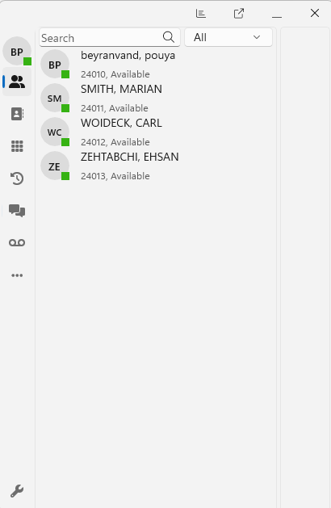

### 5. Tested Softphone Calling on iOS

A mobile softphone call was tested on iOS to confirm that calling worked from a mobile device.

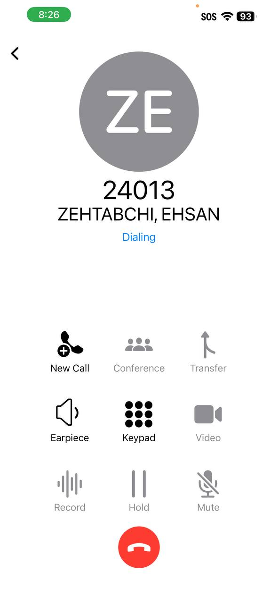

### 6. Tested Softphone Calling on Android

A mobile softphone call was also tested on Android to confirm that calling worked across different devices.

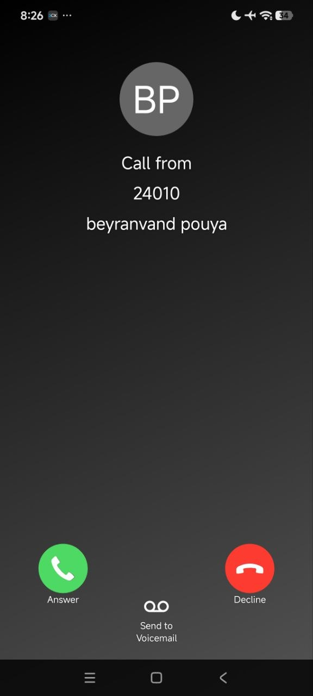

### 7. Created a Ring Group

A ring group was created to simulate shared inbound call handling for a small support team.

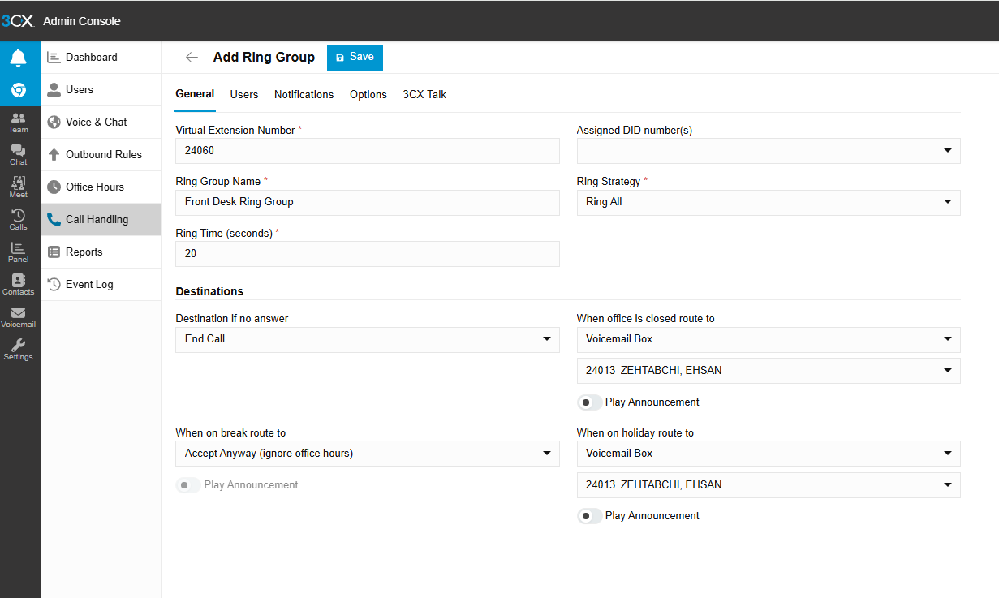

### 8. Added Users to the Ring Group

Users were added to the ring group so incoming calls could be routed to multiple extensions.

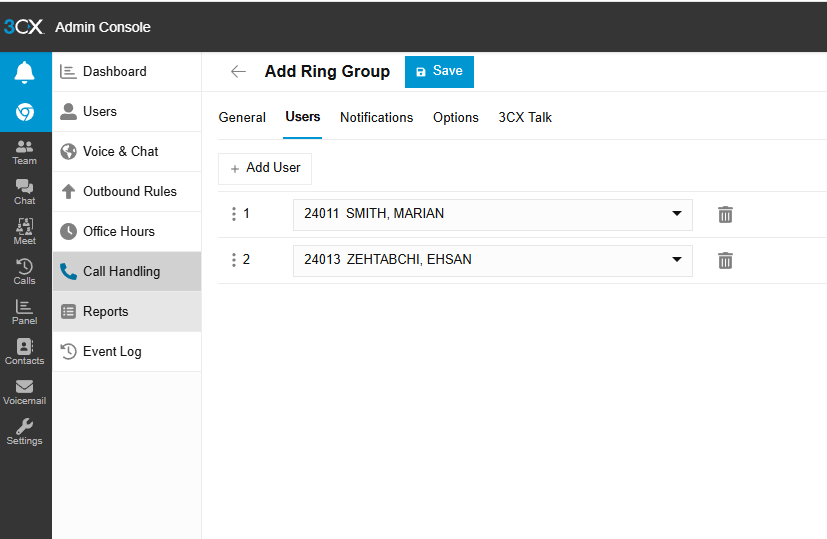

### 9. Created a Queue

A queue was created to simulate support call distribution across multiple users in a small help desk environment.

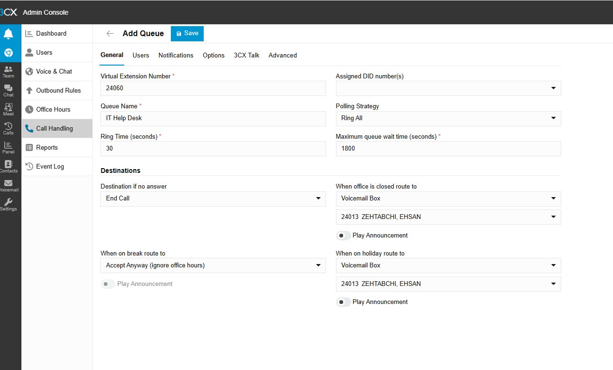

### 10. Created a Digital Receptionist and Configured IVR Key Routing

A digital receptionist was created to route callers to the correct destination based on keypad input.
Keypad options were mapped to the correct destinations so callers could be routed to an extension, queue, or ring group.

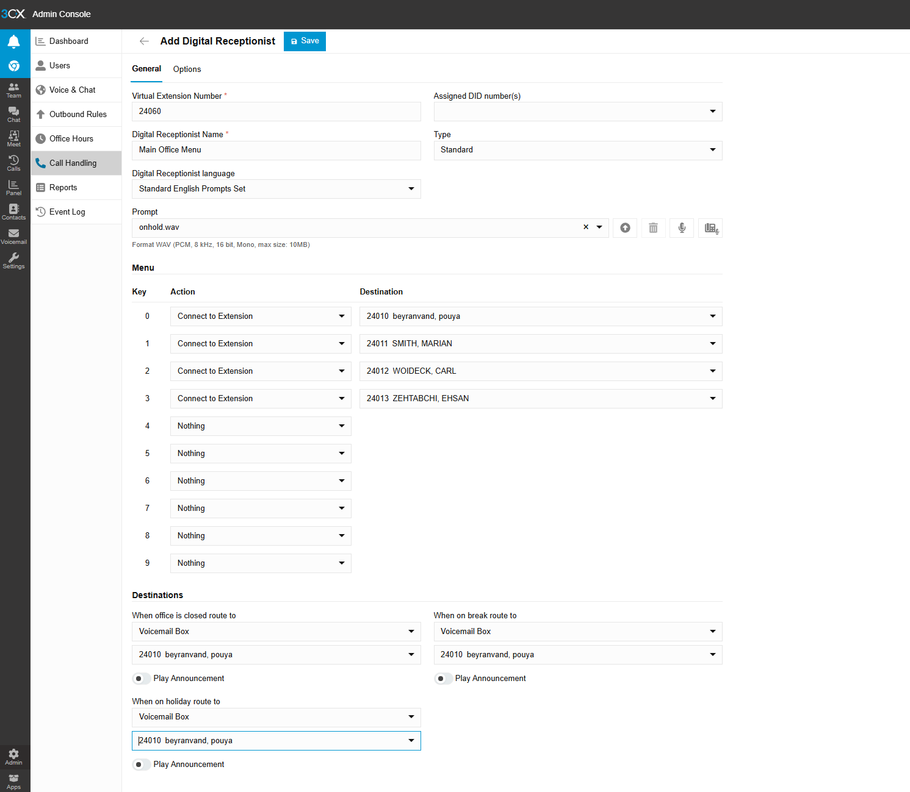

### 11. Saved the Digital Receptionist Configuration

The IVR configuration was saved after the greeting and keypad routing options were reviewed.

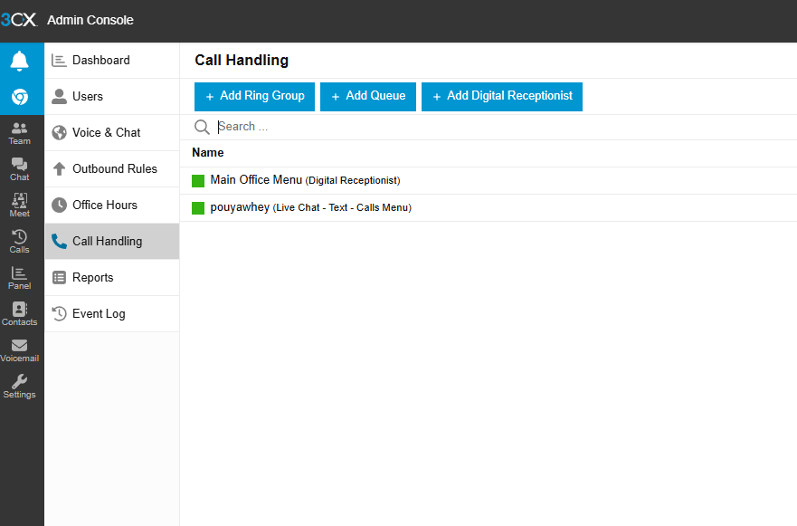

### 12. Configured Office Hours and Added Break Hours and 

Office hours were configured to define the normal business schedule for the VoIP environment.

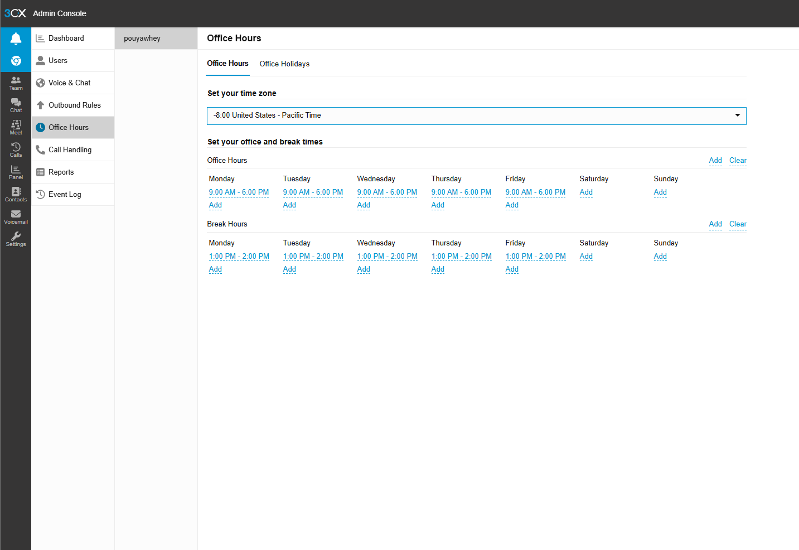

### 13. Reviewed Office Hours Routing

Office hours routing was reviewed to confirm how calls would be handled during closed hours, breaks, and holidays.

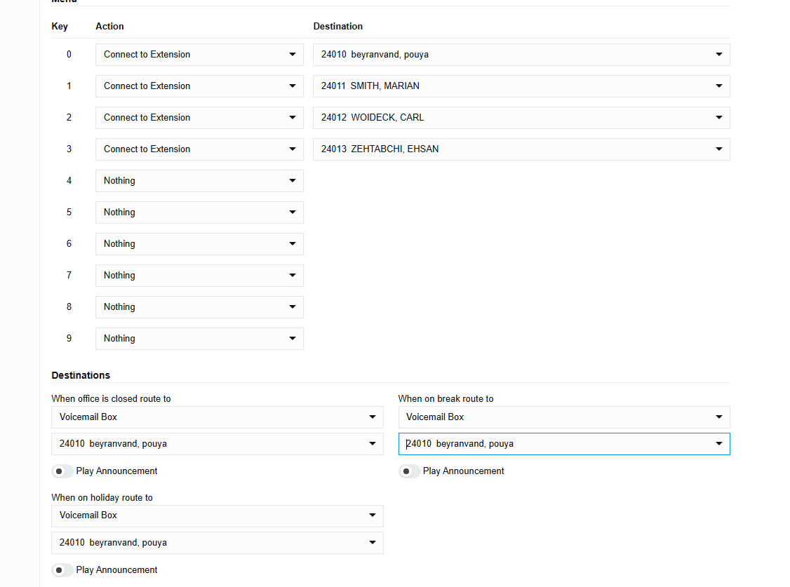

## Setup Result

At the end of the initial setup:

- the 3CX environment was active
- test users and extensions were created
- desktop and mobile softphone access was configured
- calling was tested on multiple endpoints
- a ring group was created for shared call handling

This setup provided the base environment for the ticket scenarios documented in the `tickets/` folder.
