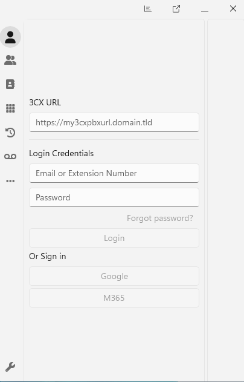
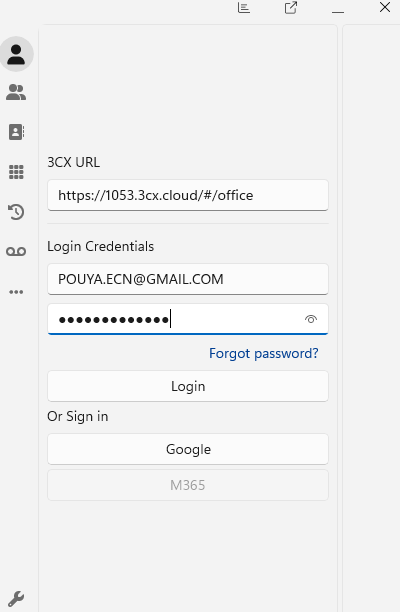
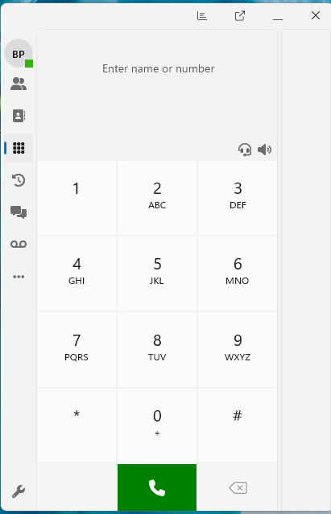
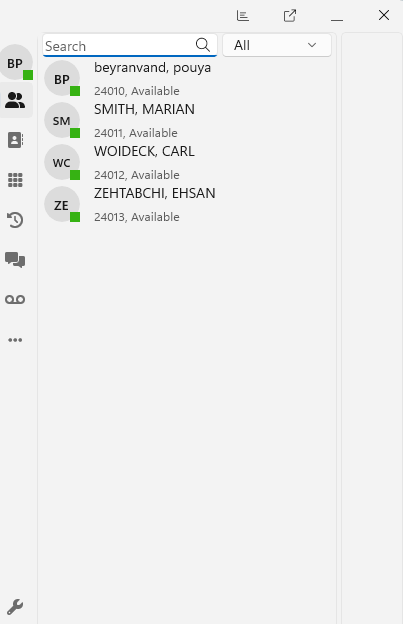

# Ticket 01 - Windows softphone not provisioned

## User Report

A user reported that the 3CX Windows softphone was installed, but the client was not configured and could not be used for calling.

## Ticket Details

| Field | Value |
|---|---|
| Ticket Type | Incident |
| Category | VoIP Client / User Support |
| Priority | Medium |
| Status | Resolved |
| Affected Service | 3CX Windows App |
| Affected User | 101 - Reception |

## Initial Symptoms

- the Windows softphone was installed
- the client was not fully configured
- the assigned user account was not ready for calling
- the user could not use the app for normal VoIP activity

## Troubleshooting Steps

### 1. Reviewed the Windows Softphone Before Configuration

The Windows app was opened to confirm that it was installed but not yet ready for normal use.

### 2. Configured the User Connection

The assigned user account was connected to the Windows softphone so the client could complete its initial setup.

### 3. Confirmed the Softphone Was Configured

After the user account was connected, the softphone loaded successfully and showed the assigned extension.

### 4. Confirmed the Client Was Ready for Use

The Windows softphone was reviewed again to confirm that it was ready for calling and user activity.

## Resolution

The issue was resolved by connecting the Windows softphone to the assigned user account and confirming successful client configuration.

## Result

The 3CX Windows softphone was configured successfully and was ready for normal use.
