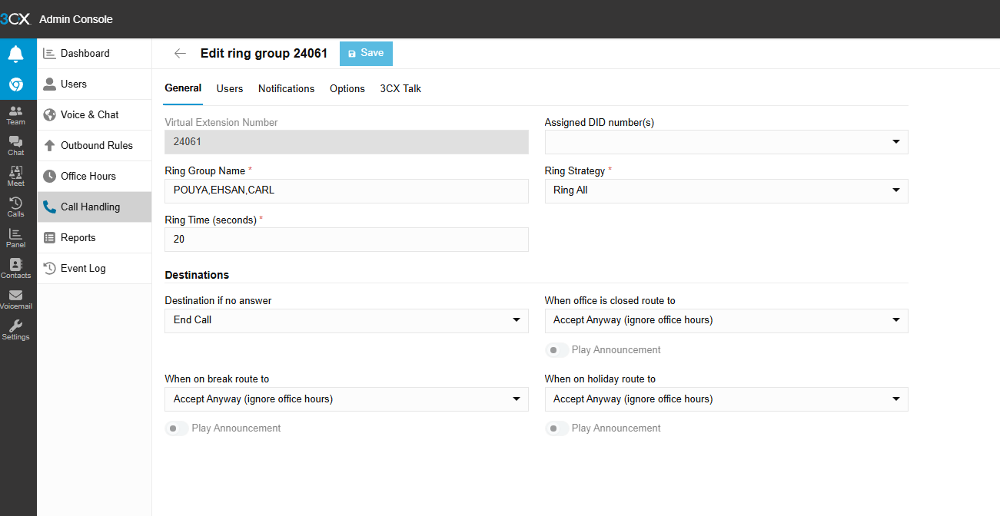
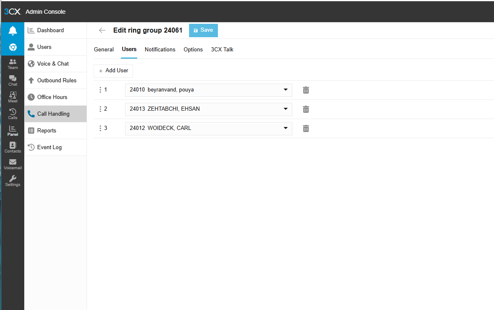
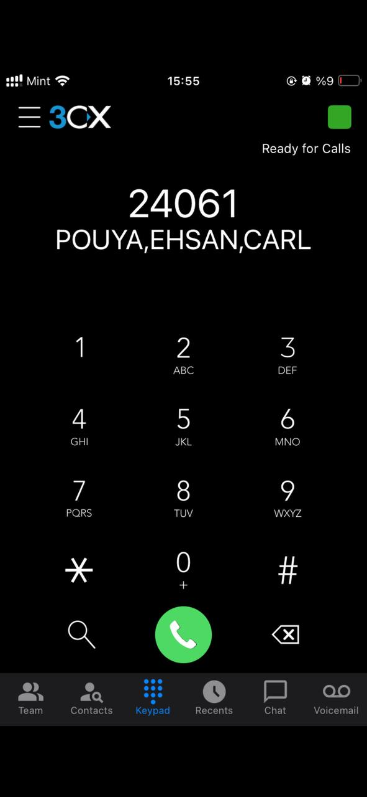
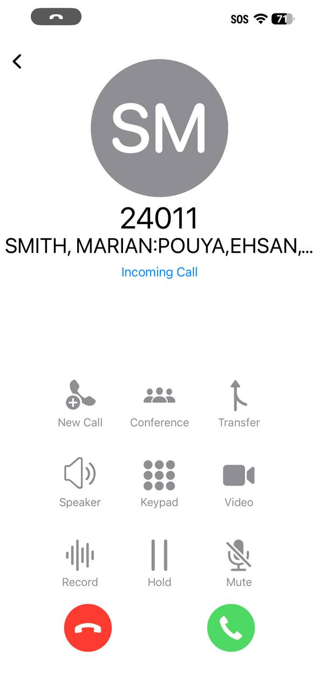
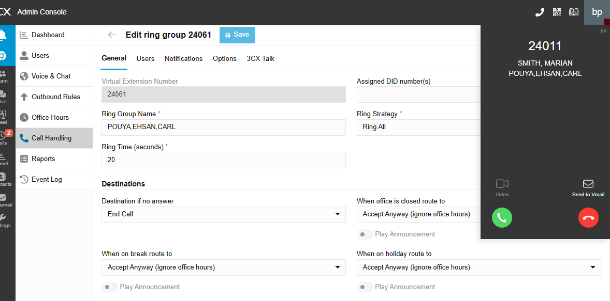

# Ticket 03 - Ring Group routing test

## User Report

A shared inbound call path was tested to confirm that the configured ring group routed calls to the assigned users correctly.

## Ticket Details

| Field | Value |
|---|---|
| Ticket Type | Service Request |
| Category | VoIP / Call Routing |
| Priority | Low |
| Status | Resolved |
| Affected Service | 3CX Ring Group |
| Tested Feature | Shared inbound call routing |

## Objective

The goal of this test was to confirm that the configured ring group routed calls to the assigned users correctly and allowed one of the users to answer the call successfully.

## Test Steps

### 1. Reviewed the Ring Group Configuration

The ring group configuration was reviewed to confirm the assigned virtual extension and routing behavior.

### 2. Reviewed the Ring Group Members

The assigned users were reviewed to confirm that multiple extensions were included in the ring group.

### 3. Placed a Test Call to the Ring Group

A test call was placed to the ring group extension to verify that inbound routing reached the assigned users.

## Result

The ring group test was completed successfully, confirming that shared inbound call routing worked correctly in the 3CX lab environment.
